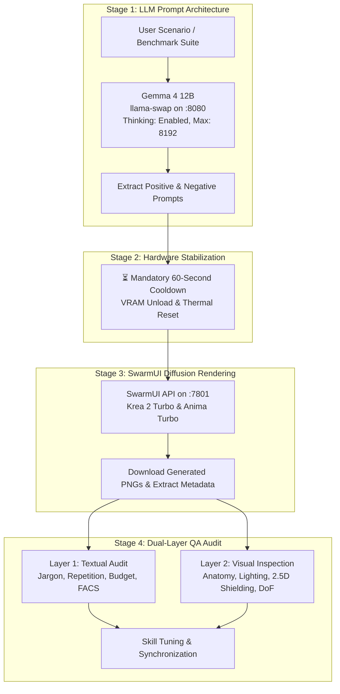

# End-to-End Benchmarking & Quality Assurance Protocol

This document defines the standardized **Quality Assurance & Benchmarking Protocol** for the **image-prompt-builder** skill suite. It enables automated, reproducible validation across small local reasoning LLMs (e.g. **Gemma 4 12B**) and local diffusion image generators (e.g. **SwarmUI** with Krea 2 & Anima).

---

## 1. Architecture Overview



---

## 2. Environment & Prerequisites

| Service | Address | Target Model / Engine | Configuration |
|---|---|---|---|
| **LLM Provider (llama-swap)** | `http://127.0.0.1:8080/v1` | `gemma4-12b` | Temperature `0.7`, `max_tokens: 8192`, Thinking: Enabled |
| **Diffusion Server (SwarmUI)** | `http://localhost:7801` | `Krea2/krea2_turbo_int8_convrot`<br>`Anima/anima_turboV10` | Steps: 10, CFG: 1.0, Sampler: `euler` |

---

## 3. How to Run the Benchmark Suite

### A. The 1-Click Master End-to-End Pipeline (Recommended)
Executes the full 10-prompt generation, enforces the 60-second cooldown, renders all 10 images in SwarmUI, and saves files to `scratch/generated_images/`:

```powershell
node "$HOME\.pi\agent\skills\image-prompt-builder\scripts\e2e_runner.mjs"
```
*Outputs:*
* Results JSON: `scratch/e2e_results.json`
* Image Gallery: `scratch/generated_images/`

---

### B. Multi-Actor Stress Benchmark Pipeline
Executes the 10 multi-actor prompt generations, enforces the 60-second cooldown, renders all 10 images in SwarmUI, and saves files to `scratch/generated_images/`:

```powershell
node "$HOME\.pi\agent\skills\image-prompt-builder\scripts\benchmark_multiactor.mjs"
```
*Outputs:*
* Results JSON: `scratch/multiactor_benchmark_results.json`
* Image Gallery: `scratch/generated_images/`

---

### C. Standalone LLM Prompt Generation (No Image Rendering)
Runs only prompt generations against Gemma 12B to rapidly audit prompt texts, word counts, and vocabulary without loading diffusion models:

```powershell
node "$HOME\.pi\agent\skills\image-prompt-builder\scripts\benchmark_runner.mjs"
```

---

### D. Standalone SwarmUI Image Generation
Generates a single prompt directly against SwarmUI and downloads the image:

```powershell
# Krea 2 Turbo Example
node "$HOME\.pi\agent\skills\image-prompt-builder\scripts\swarm_generate.mjs" `
  --model "Krea2/krea2_turbo_int8_convrot" `
  --width 1216 --height 832 --steps 10 --cfg 1.0 `
  --prompt "50mm f/1.8 prime lens. 2400K amber spotlight cuts through heavy volumetric smoke in a New Orleans cellar club. An elderly blues guitarist with weathered face leans into his worn guitar. 35mm film still."

# Anima Turbo Example
node "$HOME\.pi\agent\skills\image-prompt-builder\scripts\swarm_generate.mjs" `
  --model "Anima/anima_turboV10" `
  --width 1216 --height 688 --steps 10 --cfg 1.0 `
  --prompt "masterpiece, best quality, score_7, safe, 1girl, solo, flight suit, giant robot hand, mecha, desert, ruined hangar, cel shading, anime screencap, 2d, clean lineart, @yamashita ikuto, @imaishi hiroyuki, She rests her weight in heavy contrapposto against the rusted iron palm as 4500K desert sunlight slices through dust motes."
```

---

## 4. The 10 Standard Benchmark Scenarios

### Part A: Krea 2 Scenarios (`Krea2/krea2_turbo_int8_convrot`)
* **Aspect Ratio:** 16:9 ($1216 \times 832$) | **Steps:** 10 | **CFG:** 1.0

| ID | Name & Concept | Verification & Stress-Test Focus |
|---|---|---|
| **K2-01** | **Intimate Emotion (Blues Guitarist)**<br>*Aging blues guitarist in smoky New Orleans cellar.* | Warm 2400K amber lighting, authentic skin pores, AU1+AU4 brow furrow, volumetric smoke curls, tactile fretboard grip. |
| **K2-02** | **High-Torque Action (Skateboarder Ollie)**<br>*Skater landing high ollie over concrete stairs at sunset.* | High-speed shutter freeze ($1/2000\text{s}$), dust plume physics, bent-knee impact stance, low-angle worm's-eye lens. |
| **K2-03** | **Macro Artisan Craft (Master Jeweler)**<br>*Master jeweler setting emerald into platinum ring.* | 100mm f/2.8 macro optics, gemstone facet refraction, metallic sheen, hand/tool contact, zero Latin jargon. |
| **K2-04** | **Atmospheric Narrative (Tasmanian Ranger)**<br>*Wildlife ranger wading through misty eucalyptus forest.* | Volumetric dawn light shafts, knee-deep creek ripples, 3-plane depth (ferns $\rightarrow$ ranger $\rightarrow$ trees), pronoun variety. |
| **K2-05** | **Cinematic Fashion (Velvet Coat Tokyo Rain)**<br>*Model in midnight-blue velvet trench on wet rooftop.* | Light-absorbing velvet texture, radial stress lines, 3000K amber vs 6000K cyan neon, anamorphic bokeh discs. |

---

### Part B: Anima Scenarios (`Anima/anima_turboV10`)
* **Aspect Ratio:** 16:9 ($1216 \times 688$) | **Steps:** 10 | **CFG:** 1.0

| ID | Name & Concept | Verification & Stress-Test Focus |
|---|---|---|
| **Anima-01** | **Studio Slice of Life (Windowsill Rain)**<br>*High school student on windowsill during summer storm.* | Kyoto Animation aesthetic, zero tag-prose word repeats (`sketchbook`, `rain`), watery tareme eyes, garden bokeh. |
| **Anima-02** | **Trigger Action (Cyber-Samurai Slash)**<br>*Cyber-samurai executing downward slash against drones.* | Studio Trigger dynamic framing, `@artist` syntax, 45° torso twist, cyan plasma arc, molten spark particles. |
| **Anima-03** | **Retro 1990s Cel (Mecha Pilot Hangar)**<br>*Mecha pilot leaning against giant robot hand in desert.* | 1990s Gainax analog cel linework, heavy contrapposto posture against iron palm, zero 2.5D plastic CG bleed. |
| **Anima-04** | **Fantasy Magic (Elf Mage Butterflies)**<br>*Elf mage summoning golden butterflies beside shrine.* | 2500K golden magic radiance vs 8000K indigo moonlight, 2D clean lineart, soft cel gradients, stone forest shrine. |
| **Anima-05** | **Theatrical Marine (Free-Diver Jellyfish)**<br>*Free-diver floating among pink bioluminescent jellyfish.* | Neutral buoyancy weightlessness, glowing pink illumination, fluid hair physics, transparent dive gear shield. |

---

## 5. Dual-Layer Evaluation Rubric

Every benchmark run is evaluated across two distinct layers:

### Layer 1: Textual Audit (LLM Generation Quality)

```
┌──────────────────────────────────────┬────────────────────────────────────────────────────────┐
│ Dimension                            │ Evaluation Standard & Failure Criteria                 │
├──────────────────────────────────────┼────────────────────────────────────────────────────────┤
│ 1. Colloquial vs Clinical Jargon     │ PASS: Uses natural terms (fingertips, knuckles, brow).  │
│                                      │ FAIL: Contains Latin jargon (distal phalanges, AU-only).│
├──────────────────────────────────────┼────────────────────────────────────────────────────────┤
│ 2. Repetition & Tag Blacklist        │ PASS: Zero Danbooru tags repeated in Anima prose.       │
│                                      │ FAIL: Echoes tags word-for-word or repeats nouns 3x.   │
├──────────────────────────────────────┼────────────────────────────────────────────────────────┤
│ 3. Token & Word Budget               │ PASS: 70–100 words default (up to 150 for complex).    │
│                                      │ FAIL: Bloated prompts > 120 words with filler fluff.   │
├──────────────────────────────────────┼────────────────────────────────────────────────────────┤
│ 4. Anti-Split-Screen Positive Syntax │ PASS: Uses natural environmental anchors (left sofa,   │
│                                      │ table on right). Zero meta words (segmented, split).   │
│                                      │ FAIL: Contains "segmented into", "split into sections".│
├──────────────────────────────────────┼────────────────────────────────────────────────────────┤
│ 5. Open-Ended Narrative Artistry     │ PASS: Reads like a coherent cinematic film note.        │
│                                      │ FAIL: Stitched-together comma-separated rule list.     │
└──────────────────────────────────────┴────────────────────────────────────────────────────────┘
```

---

### Layer 2: Visual Audit (Diffusion Image Quality)

```
┌──────────────────────────────────────┬────────────────────────────────────────────────────────┐
│ Dimension                            │ Evaluation Standard & Failure Criteria                 │
├──────────────────────────────────────┼────────────────────────────────────────────────────────┤
│ 1. Biomechanical Posing & Kinetics   │ PASS: Asymmetrical contrapposto, natural weight shift. │
│                                      │ FAIL: Stiff symmetrical mannequin / T-pose posture.    │
├──────────────────────────────────────┼────────────────────────────────────────────────────────┤
│ 2. Single-Frame Multi-Actor Unity    │ PASS: Continuous unified scene with 2+ actors present. │
│                                      │ FAIL: Vertical split screen lines, panels, or diptychs.│
├──────────────────────────────────────┼────────────────────────────────────────────────────────┤
│ 3. Facial Micro-Expressions & Eyes   │ PASS: Concentrated furrow, squint, cornea catchlights. │
│                                      │ FAIL: Vacant deadpan plastic stares.                  │
├──────────────────────────────────────┼────────────────────────────────────────────────────────┤
│ 4. Tactile Object Binding            │ PASS: Fingers firmly wrap guitar neck / tools / rails. │
│                                      │ FAIL: Objects floating unattached in mid-air.          │
├──────────────────────────────────────┼────────────────────────────────────────────────────────┤
│ 5. 2.5D Style Shielding (Anime)      │ PASS: 100% flat 2D cel lineart and gouache textures.   │
│                                      │ FAIL: 3D CGI plastic skin leakage on armor/faces.      │
├──────────────────────────────────────┼────────────────────────────────────────────────────────┤
│ 6. Open-Ended Cinematic Soul         │ PASS: Image feels like a living, breathing moment.     │
│                                      │ FAIL: Generic AI stock illustration feel.              │
└──────────────────────────────────────┴────────────────────────────────────────────────────────┘
```

---

## 6. Continuous Tuning Workflow

When running benchmarks to refine skill documents:

1. **Execute Baseline:** Run `node scripts/e2e_runner.mjs`.
2. **Audit Scorecard:** Record detected weaknesses in Layer 1 (prompt text) and Layer 2 (visual PNGs).
3. **Apply Targeted Fixes:**
   * For vocabulary/repetition: Edit [`SKILL.md`](SKILL.md) Pass 2.
   * For photorealism / Krea 2: Edit [`krea2.md`](krea2.md).
   * For anime cel lineart / tags: Edit [`anima.md`](anima.md).
4. **Re-Run & Verify:** Re-execute the pipeline to confirm the before-vs-after improvement.
5. **Sync to Runtime:**
   ```powershell
   Copy-Item -Path ".\*" -Destination "$HOME\.pi\agent\skills\image-prompt-builder\" -Recurse -Force
   ```
