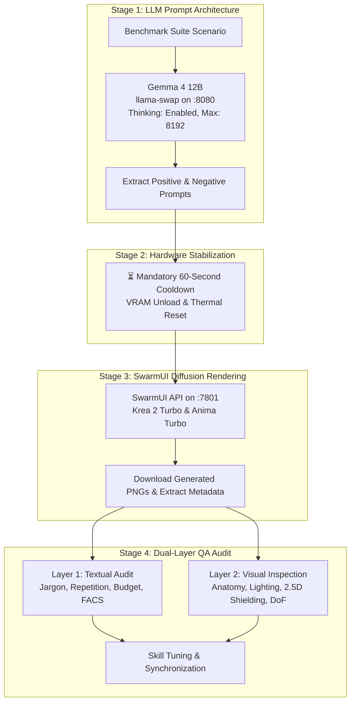

# End-to-End Benchmarking & Quality Assurance Protocol

This document defines the standardized **Quality Assurance & Benchmarking Protocol** for the **image-prompt-builder** skill suite. It enables automated, reproducible validation across small local reasoning LLMs (e.g. **Gemma 4 12B**) and local diffusion image generators (e.g. **SwarmUI** with Krea 2 & Anima).

---

## 1. Architecture Overview



---

## 2. Environment & Prerequisites

| Service | Address | Target Model / Engine | Configuration |
|---|---|---|---|
| **LLM Provider (llama-swap)** | `http://127.0.0.1:8080/v1` | `gemma4-12b` | Temperature `0.7`, `max_tokens: 8192`, Thinking: Enabled |
| **Diffusion Server (SwarmUI)** | `http://localhost:7801` | `Krea2/krea2_turbo_int8_convrot`<br>`Anima/anima_turboV10` | Steps: 10, CFG: 1.0, Sampler: `euler` |

---

## 3. How to Run the Benchmark Suites

### A. Dedicated Krea 2 Benchmark Suite (10 Components)
Evaluates 10 core architectural pillars of Krea 2 natural language prompt engineering:

```powershell
node "$HOME\.pi\agent\skills\image-prompt-builder\benchmarking\benchmark_krea2.mjs"
```
*Outputs:*
* Results JSON: `scratch/krea2_benchmark_results.json`
* Image Gallery: `scratch/generated_images/`

---

### B. Dedicated ANIMA Benchmark Suite (10 Components)
Evaluates 10 core architectural pillars of CircleStone ANIMA hybrid tag + prose prompt engineering:

```powershell
node "$HOME\.pi\agent\skills\image-prompt-builder\benchmarking\benchmark_anima.mjs"
```
*Outputs:*
* Results JSON: `scratch/anima_benchmark_results.json`
* Image Gallery: `scratch/generated_images/`

---

### C. Standalone SwarmUI Image Generation
Generates a single prompt directly against SwarmUI and downloads the image:

```powershell
# Krea 2 Turbo Example
node "$HOME\.pi\agent\skills\image-prompt-builder\benchmarking\swarm_generate.mjs" `
  --model "Krea2/krea2_turbo_int8_convrot" `
  --width 1216 --height 832 --steps 10 --cfg 1.0 `
  --prompt "50mm f/1.8 prime lens. 2400K amber spotlight cuts through heavy volumetric smoke in a New Orleans cellar club. An elderly blues guitarist with weathered face leans into his worn guitar. 35mm film still."

# Anima Turbo Example
node "$HOME\.pi\agent\skills\image-prompt-builder\benchmarking\swarm_generate.mjs" `
  --model "Anima/anima_turboV10" `
  --width 1216 --height 688 --steps 10 --cfg 1.0 `
  --prompt "masterpiece, best quality, score_7, safe, 1girl, solo, flight suit, giant robot hand, mecha, desert, ruined hangar, cel shading, anime screencap, 2d, clean lineart, @yamashita ikuto, @imaishi hiroyuki, She rests her weight in heavy contrapposto against the rusted iron palm as 4500K desert sunlight slices through dust motes."
```

---

## 4. Benchmark Scenario Matrices

### Part A: Krea 2 Benchmark Matrix (`benchmark_krea2.mjs`)

| ID | Component Under Test | Scenario & Stress Focus |
|---|---|---|
| **K2-01** | **Multi-Actor Spatial Partitioning** | *Cafe Architect vs. Barista:* Left-to-right division, zero wardrobe bleed, independent tools. |
| **K2-02** | **FACS Facial Micro-Mechanics** | *Master Watchmaker:* Action Units (AU1+AU4 brow pinch, AU7 lid tension), unretouched pores. |
| **K2-03** | **Kinetic Action & Shutter Freeze** | *Equestrian Hurdle Jump:* $1/2000\text{s}$ shutter speed freeze, airborne water droplets, bent-knee contrapposto. |
| **K2-04** | **Macro Tactile Grip & Resistance** | *Jeweler Emerald Prong Setting:* Fingertip pulp deformation, mechanical prong resistance. |
| **K2-05** | **Dual Kelvin Temperature Contrast** | *Ceramics Studio:* 5000K diffuse window daylight vs. 2800K incandescent tungsten pool. |
| **K2-06** | **3-Plane Optical Depth Staging** | *Tokyo Rain Fashion:* Defocused foreground rain-streaked glass, razor-sharp model, circular bokeh. |
| **K2-07** | **Weathered Material Physics** | *Blacksmith Anvil:* Pitted cast iron, charred hickory handles, scuffed leather, 1800K slag sparks. |
| **K2-08** | **Atmospheric Volumetric Light** | *Alpine Botanist Dawn:* Volumetric Tyndall light rays slicing through cool mountain mist. |
| **K2-09** | **Surface Contact Mechanics** | *Arctic Explorer Footing:* Heavy boot treads compacting fresh snow with deep occlusion shadows. |
| **K2-10** | **Occupational 3-Plane Crew** | *Aircraft Hangar Crew:* 3 concurrent roles across 3 depth planes (mechanic $\rightarrow$ avionics tech $\rightarrow$ supervisor). |

---

### Part B: ANIMA Benchmark Matrix (`benchmark_anima.mjs`)

| ID | Component Under Test | Scenario & Stress Focus |
|---|---|---|
| **AN-01** | **Count Tags & Feature Isolation** | *Literature Clubroom:* `2girls` tag, clean feature separation (short blue hair vs blonde twintails), independent props. |
| **AN-02** | **Danbooru Facial Micro-Geometry** | *Defiant Swordswoman:* Explicit `tsurime`, `constricted pupils`, `clenched teeth`, upward gaze. |
| **AN-03** | **Dynamic Foreshortening & Angle** | *Mid-Air Flying Kick:* `from below`, `dynamic angle`, `dynamic foreshortening`, single-arm/leg dominance. |
| **AN-04** | **Studio Trigger Chiaroscuro** | *Cyber Samurai Slash:* `@imaishi hiroyuki, @soejima shigenori`, bold angular ink linework, high pop-contrast rim light. |
| **AN-05** | **1990s Retro Cel Animation** | *Mecha Pilot in Cliffside Hangar:* `@sadamoto yoshiyuki, @yamashita ikuto`, gouache backdrop, 2.5D anti-realism shield. |
| **AN-06** | **Painterly Fantasy & Watercolor** | *Spore Forest Herbalist:* `@yoshida akihiko, @fuzichoco`, soft `tareme` eyes, floating glowing spores, earthy palette. |
| **AN-07** | **Theatrical Golden Hour Bloom** | *Observatory Twilight:* `@shinkai makoto`, translucent backlit bangs, optical lens bloom, 2600K horizon gradient. |
| **AN-08** | **Cyberpunk Precision Linework** | *Tactical Android HUD:* `@redjuice`, 9000K cyan holographic HUD telemetry, slender biomechanical armor, `jitome` gaze. |
| **AN-09** | **Secondary Wind Kinematics** | *Shrine Maiden Sakura Vortex:* `hair flowing`, `wind blown clothing`, flying cherry blossom petals, contrapposto stance. |
| **AN-10** | **Mixed-Gender Stance Opposites** | *Colosseum Duel:* `1girl 1boy` count tag, low armored katana stance vs. high staff mage pose, dual spell/steel lighting. |

---

## 5. Dual-Layer Evaluation Rubric

### Layer 1: Textual Audit (LLM Generation Quality)

| Dimension | Evaluation Standard & Failure Criteria |
|---|---|
| **1. Colloquial vs Clinical Jargon** | **PASS:** Uses natural terms (fingertips, knuckles, brow).<br>**FAIL:** Contains Latin jargon (distal phalanges, AU-only). |
| **2. Repetition & Tag Blacklist** | **PASS:** Zero Danbooru tags repeated in Anima prose.<br>**FAIL:** Echoes tags word-for-word or repeats nouns $\ge 3$ times. |
| **3. Token & Word Budget** | **PASS:** 70–100 words default (up to 150 for complex multi-actor scenes).<br>**FAIL:** Bloated prompts > 120 words with filler fluff. |
| **4. Anti-Split-Screen Positive Syntax** | **PASS:** Uses natural environmental anchors (left sofa, table on right). Zero meta words (segmented, split).<br>**FAIL:** Contains "segmented into", "split into sections". |
| **5. Open-Ended Narrative Artistry** | **PASS:** Reads like a coherent cinematic film note.<br>**FAIL:** Stitched-together comma-separated rule list. |

---

### Layer 2: Visual Audit (Diffusion Image Quality)

| Dimension | Evaluation Standard & Failure Criteria |
|---|---|
| **1. Biomechanical Posing & Kinetics** | **PASS:** Asymmetrical contrapposto, natural weight shift.<br>**FAIL:** Stiff symmetrical mannequin / T-pose posture. |
| **2. Single-Frame Multi-Actor Unity** | **PASS:** Continuous unified scene with 2+ actors present.<br>**FAIL:** Vertical split screen lines, panels, or diptychs. |
| **3. Facial Micro-Expressions & Eyes** | **PASS:** Concentrated furrow, squint, cornea catchlights.<br>**FAIL:** Vacant deadpan plastic stares. |
| **4. Tactile Object Binding** | **PASS:** Fingers firmly wrap guitar neck / tools / rails with contact deformation.<br>**FAIL:** Objects floating unattached in mid-air. |
| **5. 2.5D Style Shielding (Anime)** | **PASS:** 100% flat 2D cel lineart and gouache textures.<br>**FAIL:** 3D CGI plastic skin leakage on armor/faces. |
| **6. Cinematic Atmosphere & Lighting** | **PASS:** Distinct Kelvin temperature highlights and contact occlusion shadows.<br>**FAIL:** Flat ambient lighting with washed-out contrast. |

---

## 6. Continuous Tuning Workflow

When running benchmarks to refine skill documents:

1. **Execute Target Benchmark:**
   ```powershell
   node benchmarking/benchmark_krea2.mjs
   # OR
   node benchmarking/benchmark_anima.mjs
   ```
2. **Audit Scorecard:** Record detected weaknesses in Layer 1 (prompt text) and Layer 2 (visual PNGs).
3. **Apply Targeted Fixes:**
   * For vocabulary/repetition: Edit [`SKILL.md`](../SKILL.md) Pass 2.
   * For photorealism / Krea 2: Edit [`krea2.md`](../krea2.md).
   * For anime cel lineart / tags: Edit [`anima.md`](../anima.md).
4. **Re-Run & Verify:** Re-execute the benchmark to confirm the before-vs-after improvement.
5. **Sync to Runtime:**
   ```powershell
   Copy-Item -Path ".\*" -Destination "$HOME\.pi\agent\skills\image-prompt-builder\" -Recurse -Force
   ```
