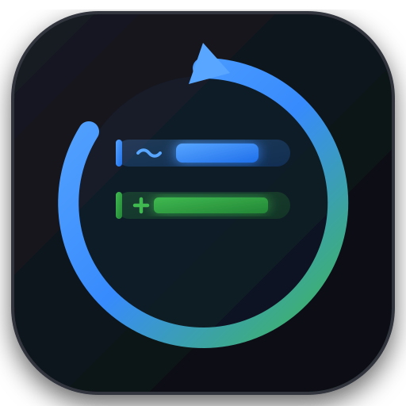

  

# Reload Diff ⚡

**Instant in-editor diff highlights on silent file reloads — works anywhere, zero Git required.**

When background AI agents (Claude Code, Aider, OpenCode, background scripts) or external tools modify your open files, VS Code silently swaps the text under your feet. **Reload Diff** automatically detects external reloads, highlights exactly what changed with word-level precision, and fades away automatically.

---

## ✨ Features

- 🟦 **Modified Lines**: Soft blue line wash + solid 4px blue indicator bar + **high-contrast per-word highlight** on the changed characters.
- 🟩 **Added Lines**: Soft green line wash + solid 4px green indicator bar.
- 🟥 **Deleted Lines**: Red indicator and overview ruler marker showing where code was removed.
- ⏱️ **Auto-Fade Timer**: Highlights automatically fade after 30 seconds (configurable) so your screen cleans itself up.
- 🔍 **1-Click Full Inline Review**: Click `$(diff) Reload Diff: +X ~Y -Z` in the status bar to open the full Antigravity / Monaco red/green inline diff editor.
- 🤖 **Hover Diff Inspector**: Hover over any modified or deleted line to view a formatted markdown before/after diff tooltip.
- ⚡ **Zero Dependencies & Offline**: Pure vanilla JavaScript using an optimized Myers line & word diff algorithm. Works without Git repositories.

---

## 🚀 How It Works

1. Keep any file open in a VS Code tab.
2. An external AI agent or terminal command edits the file on disk.
3. VS Code reloads the file — **Reload Diff** immediately paints:
   - Green bars & tints on new lines.
   - Blue bars & tints on modified lines, with exact changed words highlighted.
4. Highlights automatically disappear after 30 seconds (or immediately when you edit or dismiss).

---

## ⚙️ Configuration

Open your VS Code **Settings** (`Ctrl+,`) and search for `reloadDiff`:

| Setting | Default | Description |
| :--- | :--- | :--- |
| `reloadDiff.enabled` | `true` | Master On/Off switch for diff highlighting. |
| `reloadDiff.autoFadeSeconds` | `30` | Seconds before highlights fade (set to `0` to keep highlights until manual clear). |
| `reloadDiff.highlightLineBackground` | `true` | Toggle soft line background tinting on/off. |
| `reloadDiff.addedLineColor` | `""` | Custom background color for added lines (empty string uses theme green). |
| `reloadDiff.modifiedLineColor` | `""` | Custom background color for modified lines (empty string uses soft blue). |
| `reloadDiff.modifiedWordColor` | `""` | Custom color for changed word highlights. |

---

## ⌨️ Commands

Access these from the Command Palette (`Ctrl+Shift+P`):

- **`Reload Diff: Compare Active File with State Before Reload`** — Opens the full inline side-by-side diff against the pre-reload snapshot.
- **`Reload Diff: Clear Highlights`** — Clears diff highlights for the active file immediately.
- **`Reload Diff: Toggle Highlighting`** — Quickly enables or disables the extension globally.

---

## 📄 License

MIT
